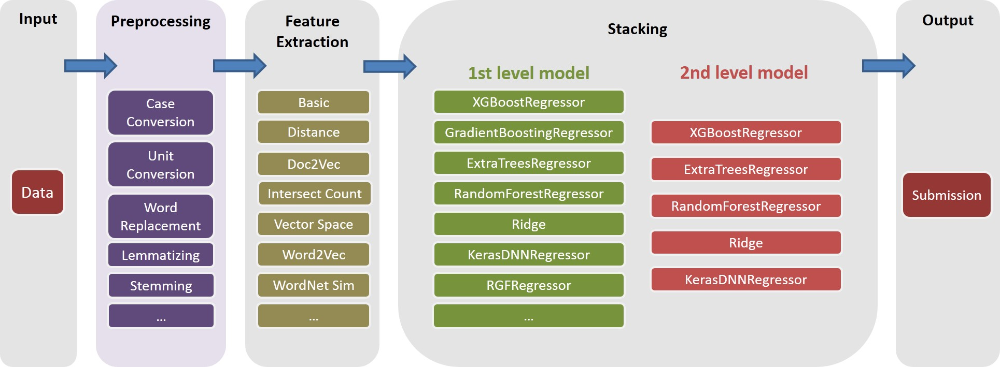

# Kaggle_HomeDepot
Turing Test's Solution for [Home Depot Product Search Relevance Competition on Kaggle](https://www.kaggle.com/c/home-depot-product-search-relevance)

## Submission
| Submission | CV RMSE | Public LB RMSE | Private LB RMSE | Position |
| :--- | :-------: | :--------------: | :---------------: | :------------------: |
| Simplified Single Model from Igor and Kostia (10 features) | 0.44792 | 0.45072 | 0.44949 | **31** |
| Best Single Model from Igor and Kostia | 0.43787 | 0.44017 | 0.43895 | **11** |
| Best Single Model from Chenglong | 0.43832 | 0.43996 | 0.43811 | **9** |
| Best Ensemble Model from Igor and Kostia | - | 0.43819 | 0.43704 | **8** |
| Best Ensemble Model from Chenglong | 0.43550 | 0.43555 | 0.43368 | **6** |
| Best Final Ensemble Model | - | 0.43433| 0.43271 | **3** |

## FlowChart

## Documentation

See `./Doc/Kaggle_HomeDepot_Turing_Test.pdf` for documentation.

## Instruction

### Chenglong's Part
Before proceeding, one should place all the data from the [competition website](https://www.kaggle.com/c/home-depot-product-search-relevance/data) into folder `./Data`.

Note that in the following, all the commands and scripts are executed and run in directory `./Code/Chenglong`.

#### Step 1. Install Dependencies
#####1. Python
We used Python 3.5.1 and modules comes with [Anaconda 2.4.1 (64-bit)](https://repo.continuum.io/archive/Anaconda3-2.4.1-Linux-x86_64.sh). In addition, we also used the following libraries and modules:
- [gensim 0.12.4](https://github.com/piskvorky/gensim/archive/0.12.4.tar.gz)
- [hyperopt 0.0.3.dev](https://github.com/hyperopt/hyperopt)
- [keras 0.3.2](https://github.com/fchollet/keras/archive/0.3.2.tar.gz)
- [matplotlib-venn 0.11.3](https://pypi.python.org/pypi/matplotlib-venn)
- [python-Levenshtein 0.12.0](https://pypi.python.org/pypi/python-Levenshtein/0.12.0)
- [regex 2.4.85](https://pypi.python.org/pypi/regex)
- [xgboost 0.4](https://github.com/dmlc/xgboost/archive/v0.40.tar.gz)

#####2. R
We used the following packages installed via `install.packages()`:
- data.table
- Rtsne

#####3. Other
We used the following thirdparty packages:
- [rgf 1.2](http://stat.rutgers.edu/home/tzhang/software/rgf/rgf1.2.zip)

#### Step 2. Prepare External Data
#####1. Pre-trained Word2Vec Model
We used pre-trained Word2Vec models listed in this [Github repo](https://github.com/3Top/word2vec-api). In specific:
- [Google News](https://drive.google.com/file/d/0B7XkCwpI5KDYNlNUTTlSS21pQmM/)
- [Wikipedia+Gigaword 5](http://nlp.stanford.edu/data/glove.6B.zip)

We used [glove-gensim](https://github.com/manasRK/glove-gensim) to convert GloVe vectors into Word2Vec format for easy usage with Gensim. After that, put all the models in the corresponding directory (see `config.py` for detail).

#####2. Other
We also used the following external data:
- Color data from this [Kaggle forum post](https://www.kaggle.com/c/home-depot-product-search-relevance/forums/t/18967/data-preparation), i.e., `./Data/dict/color_data.py` in this repo.
- Google spelling correction dictionary from this [Kaggle forum post](https://www.kaggle.com/steubk/home-depot-product-search-relevance/fixing-typos), i.e., `google_spelling_checker_dict.py` in this repo.
- Home-made word replacement dictionary, i.e., `./Data/dict/word_replacer.csv` in this repo.
- NLTK corpora and taggers data downloaded using `nltk.download()`, specifically: `stopwords.zip`, `wordnet.zip` and `maxent_treebank_pos_tagger.zip`.

#### Step 3. Generate Features
To generate data and features, one should run `python run_data.py`. While we have tried our best to make things as parallelism and efficient as possible, this part might still take 1 ~ 2 days to finish, depending on the computational power. So be patient :)

Note that various text processing are useful for introducing diversity into ensemble. As a matter of fact, one feature set (i.e., `basic20160313`) from our final solution is generated before the [Fixing Typos post](https://www.kaggle.com/steubk/home-depot-product-search-relevance/fixing-typos), i.e., not using the Google spelling correction dictionary. Such version of features can be generated by turning off the `GOOGLE_CORRECTING_QUERY` flag in `config.py`.

After team merging with Igor&Kostia, we have rebuilt everything from scratch, and most of our models used different subsets of Igor&Kostia's features. For this reason, you should also need to generate their features. Since Igor&Kostia's features are in `.csv` dataframe format, we provide a converter `turing_test_converter.py` to convert them to the format we use, i.e., `.pkl`.

#### Step 4. Generate Feature Matrix
In step 3, we have generated a few thousands of features. However, only part of them will be used to build our model. For example, we don't need those features that have very little predictive power (e.g., have very small correlation with the target relevance.) Thus we need to do some feature selection.

In our solution, feature selection is enabled via the following two successive steps.
#####1. Regex Style Manual Feature Selection
This approach is implemented as `get_feature_conf_*.py`. The general idea is to include or exclude specific features via `regex` operations of the feature names. For example, 
- one can specify the features that he want to **include** via the `MANDATORY_FEATS` variable, despite of its correlation with the target 
- one can also specify the features that he want to **exclude** via the `COMMENT_OUT_FEATS` variable, despite of its correlation with the target (`MANDATORY_FEATS` has higher priority than `COMMENT_OUT_FEATS`.)

The output of this is a feature conf file. For example, after running the following command:  
`python get_feature_conf_nonlinear.py -d 10 -o feature_conf_nonlinear_201605010058.py`  
we will get a new feature conf `./conf/feature_conf_nonlinear_201605010058.py` which contains a feature dictionary specifying the features to be included in the following step.

One can play around with `MANDATORY_FEATS` and `COMMENT_OUT_FEATS` to generate different feature subset. We have included in `./conf` a few other feature confs from our final submission. Among them, `feature_conf_nonlinear_201604210409.py` is used to build the best single model.

#####2. Correlation based Feature Selection
With the above generated feature conf, one can combine all the features into a feature matrix via the following command:  
`python feature_combiner.py -l 1 -c feature_conf_nonlinear_201604210409 -n basic_nonlinear_201604210409 -t 0.05`

The `-t 0.05` above is used to enable the correlation base feature selection. In this case, it means: drop any feature that has a correlation coef lower than `0.05` with the target relevance.

TODO(Chenglong): Explore other feature selection strategies, e.g., greedy forward feature selection (FFS) and greedy backward feature selection (BFS).

#### Step 5. Generate Submission
#####1. Various Tasks
In our solution, a `task` is an object composite of a specific `feature` (e.g., `basic_nonlinear_201604210409`) and a specific `learner` (`XGBoostRegressor` from [xgboost](https://github.com/dmlc/xgboost)). The definitions for `task`, `feature` and `learner` are in `task.py`.

Take the following command for example.    
`python task.py -m single -f basic_nonlinear_201604210409 -l reg_xgb_tree -e 100`  
- It runs a `task` with `feature` `basic_nonlinear_201604210409` and `learner` `reg_xgb_tree`. 
- The `task` is optimized with [hyperopt](https://github.com/hyperopt/hyperopt) for `100` evals for searching the best parameters for `learner` `reg_xgb_tree`. 
- The `task` performs both CV and final refit. CV in this case has two purposes: 1) guide hyperopt to find the best parameters, and 2) generate predictions for each CV fold for further (2nd and 3rd level) stacking. 
- For all the available learners and the corresponding parameter searching space, please see `model_param_space.py`.

During the competition, we have run various tasks (i.e., various features and various learners) to generate a diverse 1st level model library. Please see `./Log/level1_models` for all the tasks we have included in our final submission.

#####2. Best Single Model
After generating the `feature` `basic_nonlinear_201604210409` (see step 4 how to generate this), run the following command to generate the best single model:  
`python task.py -m single -f basic_nonlinear_201604210409 -l reg_xgb_tree_best_single_model -e 1`

This should generate a submission with local CV RMSE around 0.438 ~ 0.439.

#####3. Best Ensemble Model
After building **some diverse** 1st level models, run the following command to generate the best ensemble model:  
`python run_stacking_ridge.py -l 2 -d 0 -t 10 -c 1 -L reg_ensemble -o`

This should generate a submission with local CV RMSE around 0.436.

### Igor&Kostia's Part

Before proceeding, one should specify correct paths in file `config_IgorKostia.py` and place all the data from the [competition website](https://www.kaggle.com/c/home-depot-product-search-relevance/data) into folder specified by variable `DATA_DIR`.  To reproduce our `Ensemble_B`   from Step IK5  one should place the used feature sets into folder specified by variable `FEATURESETS_DIR`. Note that in the following, all the commands and scripts are executed and run in directory `./Code/Igor&Kostia`.

#### Step IK1. Install Dependencies
#####1. Python

We used Python 2.7.11  on Windows platform and modules comes with Anaconda 2.4.0 (64-bit), including:
- scikit-learn 0.17.1
- numpy 1.10.1
- pandas 0.17.0
- re 2.2.1
- matplotlib 1.4.3
- scipy 0.16.0

In addition, we also used the following libraries and modules:
- NLTK 3.1 (use `nltk.download()` command)
- [gensim 0.12.4](https://github.com/piskvorky/gensim/archive/0.12.4.tar.gz)
- [xgboost 0.4](https://github.com/dmlc/xgboost/archive/v0.40.tar.gz)

Some descriptive analysis and final model blending was also done in Excel 2007 and Excel 2010.

#### Step IK2. Text Preprocessing
We do all text preprocessing before any feature generation and save the results to files. It helped us save a few computing days since the same preprocessing steps are necessary to generate different features.
- Run `text_processing.py`.
- Run `text_processing_wo_google.py`.

The necessary replacement data is loaded automatically from files  `homedepot_functions.py` and `google_dict.py`.

#### Step IK3. Feature Generation
We need to run consequently the following files:
- `feature_extraction1.py`.
- `grams_and_terms_features.py`.
- `dld_features.py`.
- `word2vec.py`.

To generate features without using the Google dictionary, we also need to run:
- `feature_extraction1_wo_google.py`.
- `word2vec_without_google_dict.py`.

As a result, we will have a few csv files with the necessary features for model building. 

#### Step IK4. Generate Benchmark Model with Feature Importances
- Run `generate_feature_importances.py`.

#### Step IK5. Generate Submission File
One part of the ensemble `Ensemble_A` is generated from the following code:
- `generate_models.py`.
- `generate_model_wo_google.py`.
- `generate_ensemble_output_from_models.py`.

To get the other part `Ensemble_B`, we need to run these files:
- `ensemble_script_imitation_version.py` (It just reproduces the selection of random features generated from `ensemble_script_random_version.py`. You do not need to run `ensemble_script_random_version.py` again).
- `model_selecting.py`.

These two parts can be generated in parallel. Our final submission from Igor&Kostia was then prodused in Excel as:
`Output`=0.75 `Ensemble_A`+ 0.25 `Ensemble_B`

###  Blending Two Ensembles into the Final Submissions
So, we had two ensembles prepared using different methodologies. We observed that our ensembles behave differently in different parts of the datasets (`part1`:  `id<=163700`,  `part2`:  `163700 < id  <= 221473`,
`part_3`:  `id > 221473`.  Since we observed regular patterns in the data as well, we thought that one of the ensembles might be especially prone to overfitting in some parts. So, while blending our ensembles for final submissions, we made different bets assuming that in some parts one of the models would behave much worse in private than in public.

Our two final submission were produced in Excel with the weights from  the table below (the weight for Chenglong's and Igor&Kostia's parts add up to 1). Both these submissions scored the same `0.43271` on the private leaderboard.

|    | Weight Chenglong for `part1` and `part2` | Weight Chenglong for `part3`| Public LB RMSE | Private LB RMSE |
| :-----------------: | :---------: | :---------: | :---------------: | :---------------: | 
| Submission 1 | 0.75 | 0.8 | 0.43443 | 0.43271 |
| Submission 2 | 0.6  | 0.3 | 0.43433 | 0.43271 |

